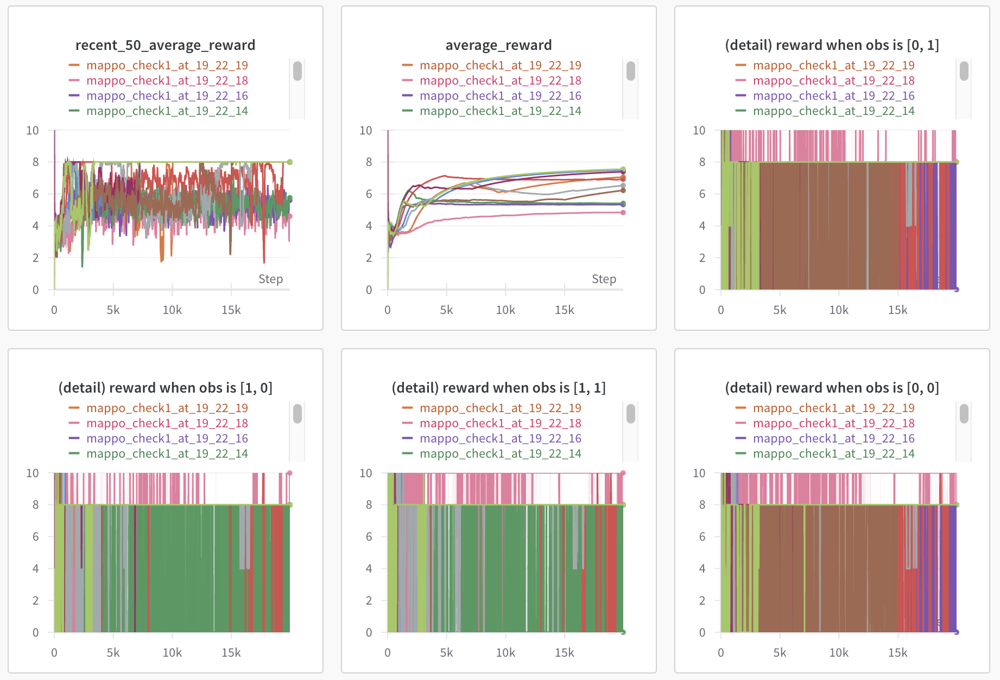
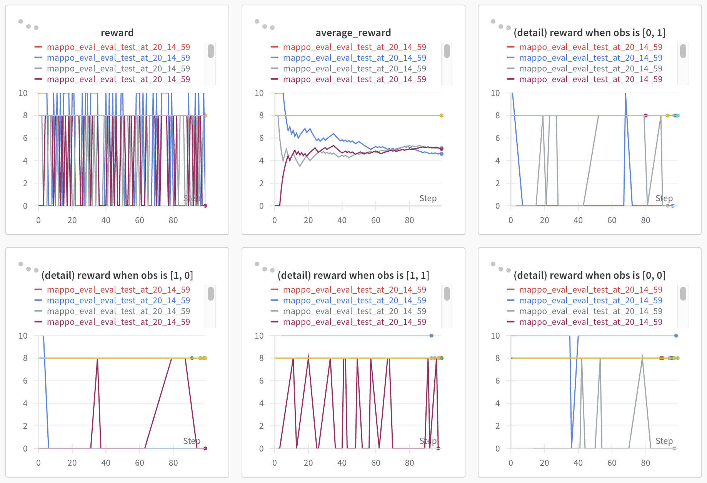

# MAPPO-in-TinyHanabi

## Setting
Game: Tiny-Hanabi

Origin Code: [on-policy](https://github.com/marlbenchmark/on-policy)


## About this project

Implementing Tiny-Hanabi Environment for MAPPO

## Test Environment
```
env: "TinyHanabi"
hanabi: "TinyHanabi"
algo: "mappo"
seed: [1,2,3,4,5,6,7,8,9,10]
n_rollout_threads: 128
num_mini_batch: 1
num_env_steps: 20000
ppo_epoch: 10
gain: 0.01
lr: 5e-3
critic_lr: 5e-3
hidden_size: 32
layer_N: 2
entropy_coef: 0.015
log_interval: 100
save_interval: 100
episode_length: 128
use_valuenorm
```
## Result
```
Run 1   | mean: 8.0, variance: 0.0
Run 2   | mean: 8.0, variance: 0.0
Run 3   | mean: 8.0, variance: 0.0
Run 4   | mean: 8.0, variance: 0.0
Run 5   | mean: 8.0, variance: 0.0
Run 6   | mean: 8.0, variance: 0.0
Run 7   | mean: 5.04, variance: 14.918399999999997
Run 8   | mean: 5.12, variance: 14.7456
Run 9   | mean: 4.6, variance: 24.83999999999999
Run 10  | mean: 8.0, variance: 0.0
Sum     | mean: 7.076, variance: 7.458224000000001
```
## Other
<div align="center">
  <table>
    <tr>
      <td align="center">
        
        <p>Graph of training process</p>
      </td>
      <td align="center">
        
        <p>Graph of evaluation process</p>
      </td>
    </tr>
  </table>
</div>
